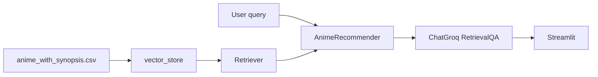
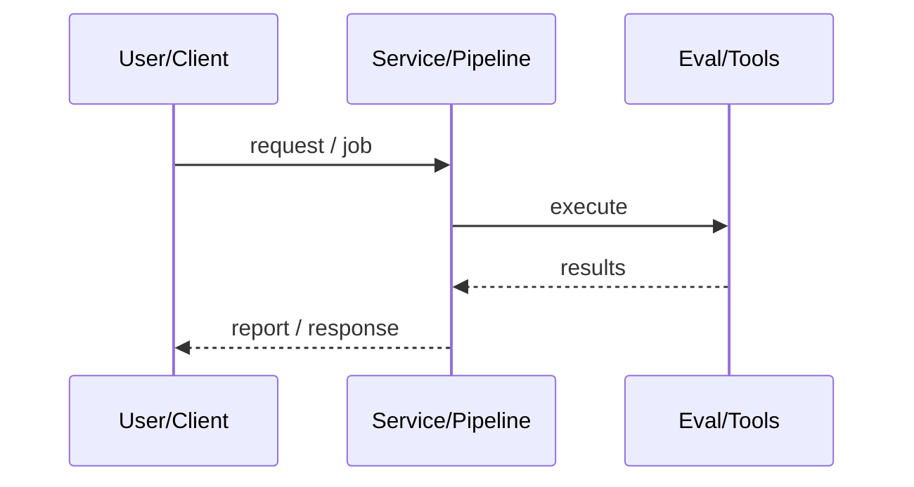
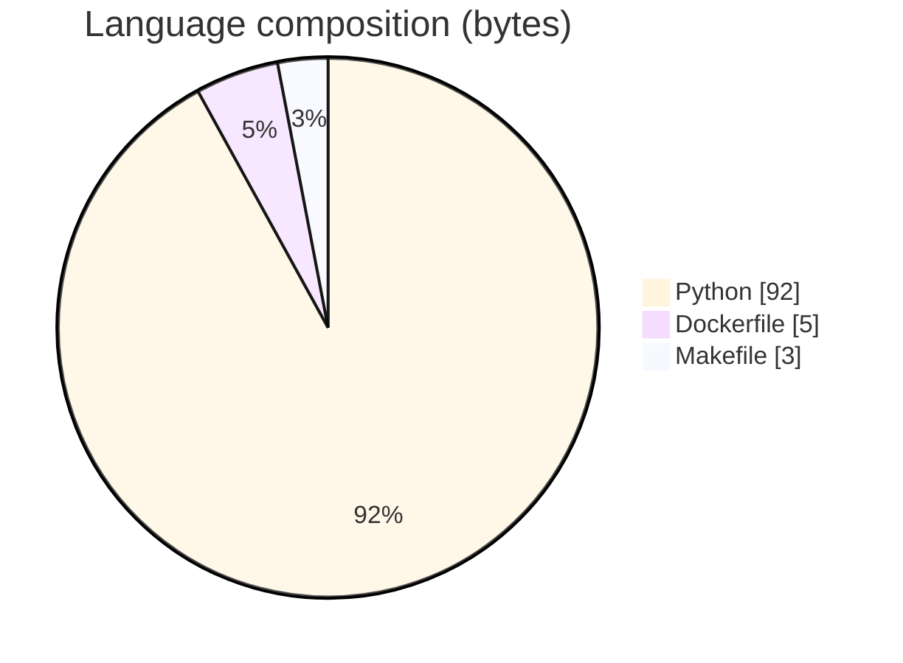

# AniSage — RAG Anime Recommender

### Streamlit RAG recommender: Chroma + Hugging Face embeddings + Groq LLaMA RetrievalQA over anime synopsis data, with Docker/K8s.

[](https://github.com/ArchanaChetan07/Anime-Recommender-System)
[](https://github.com/ArchanaChetan07/Anime-Recommender-System)
[](https://github.com/ArchanaChetan07/Anime-Recommender-System)
[](https://github.com/ArchanaChetan07/Anime-Recommender-System/actions)

---

## Overview

Preference-based anime discovery needs natural-language queries grounded in a curated catalog rather than opaque collaborative-filtering scores alone.

Build vector store from anime_with_synopsis.csv, retrieve with LangChain, generate with ChatGroq RetrievalQA; Streamlit front end; pipeline builders; Makefile/Docker/K8s manifests and pytest.

Deployable RAG app returning answers plus source titles from retrieved chunks; CI-present packaging.

This repository is maintained as **production-minded portfolio work**: clear architecture, automated checks where present, and metrics that are **traceable to committed artifacts** (never invented).

---

## Architecture

CSV ingest → embeddings → Chroma retriever → Groq RetrievalQA → Streamlit response with sources





---

## Results & repository facts

> Only values found in code, configs, tests, or generated reports are listed. Absence of a clinical/ML accuracy number means it was **not** published in-repo.

| Metric | Value | Source |
|---|---|---|
| Tracked blobs on main | **27** | `git tree main` |
| Tracked files | **27** | `git tree` |
| Python modules | **17** | `git tree` |
| Test-related paths | **1** | `git tree` |
| CI workflows | **Yes** | `.github/workflows` |
| Docker present | **Yes** | `repo root` |



---

## Key features

- Synopsis CSV → embedding vector store pipeline
- Typed RecommendationResult with source titles
- Streamlit UI (app/app.py)
- Dockerfile + k8s/anisage-k8s.yaml
- pytest + GitHub Actions

---

## Tech stack

| Layer | Technology |
|---|---|
| language | Python |
| rag | LangChain RetrievalQA |
| vectorstore | ChromaDB |
| embeddings | sentence-transformers |
| llm | langchain-groq |
| ui | Streamlit |
| deploy | Docker / Helm-style k8s YAML |

---

## Skills demonstrated

Python · LangChain · ChromaDB · sentence-transformers · Groq · Streamlit · Docker · CI/CD · testing · automation

Keyword surface: **Python · Python · machine-learning · CI/CD · testing · API · Docker · automation · data-science · software-engineering · system-design · observability · LLM · cloud**

---

## Project structure

```text
Anime-Recommender-System/
├── app/app.py
├── src/{data_loader,vector_store,recommender,prompt_template}.py
├── pipeline/
├── data/anime_with_synopsis.csv
├── k8s/anisage-k8s.yaml
├── Dockerfile
└── tests/
```

---

## Installation & usage

```bash
git clone https://github.com/ArchanaChetan07/Anime-Recommender-System.git
cd Anime-Recommender-System
pip install -r requirements.txt
cp .env.example .env  # set GROQ_API_KEY
streamlit run app/app.py
```

---

## How it works

Pipeline embeds anime synopsis documents into Chroma; at query time AnimeRecommender builds a Groq-backed RetrievalQA chain, returns the LLM answer and source documents, and the UI surfaces titles parsed from chunk metadata.

---

## Future improvements

- Offline demo mode without Groq
- Hybrid CF + content re-ranker if CF is desired
- Rewrite README to match RAG implementation (not 'hybrid CF')

---

## License

See repository.

---

<p align="center">
  <b>AniSage — RAG Anime Recommender</b><br/>
  <a href="https://github.com/ArchanaChetan07/Anime-Recommender-System">github.com/ArchanaChetan07/Anime-Recommender-System</a>
</p>
