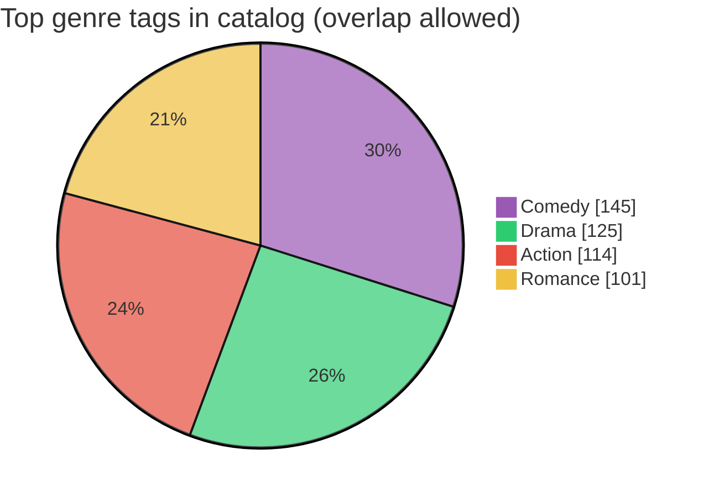
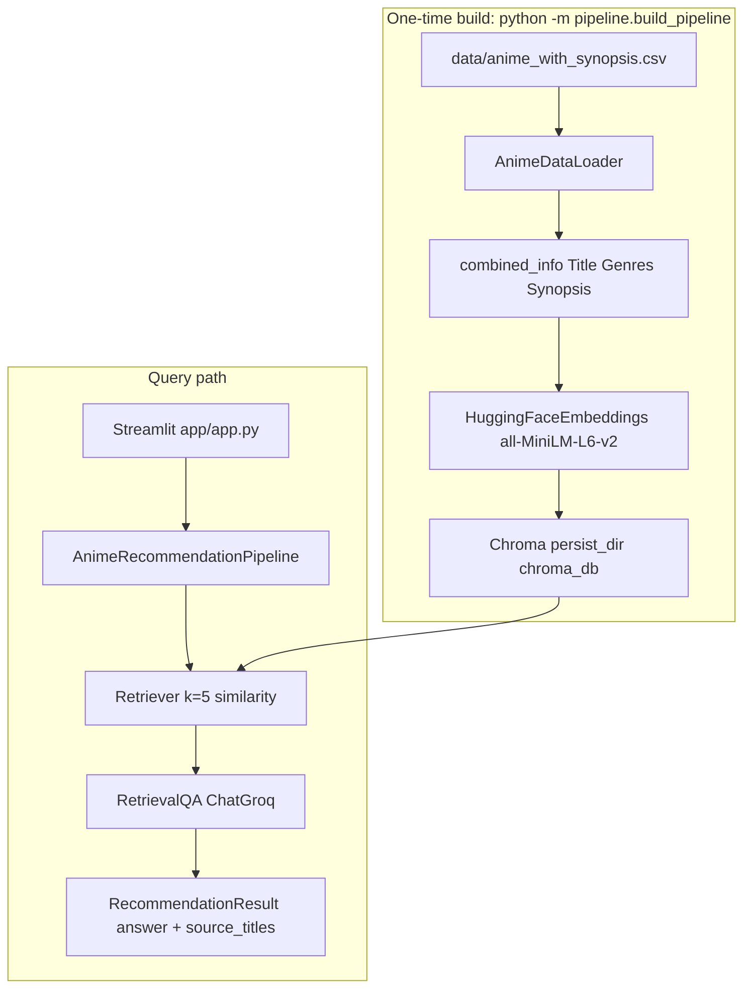
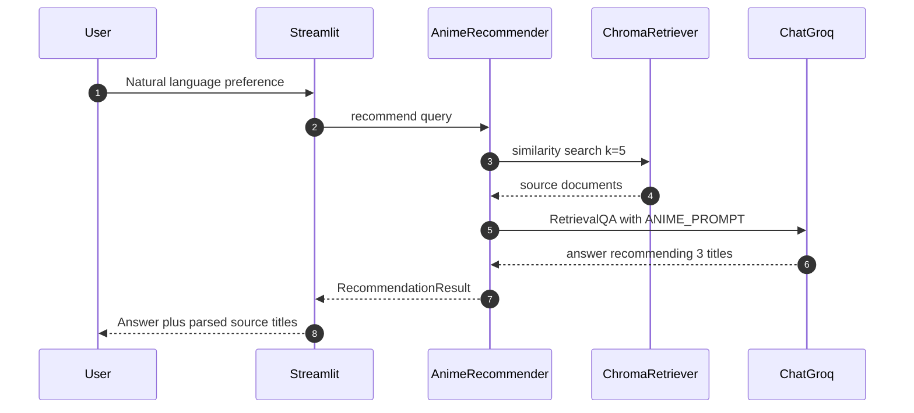

# AniSage — RAG Anime Recommender

### Streamlit app: Chroma + Hugging Face embeddings + Groq LLaMA RetrievalQA over MAL synopsis data, packaged with Docker and Kubernetes

[](https://github.com/ArchanaChetan07/Anime-Recommender-System/actions/workflows/ci.yml)
[](Dockerfile)
[](src/recommender.py)
[](src/vector_store.py)
[](config/settings.py)
[](app/app.py)
[](Dockerfile)
[](tests/test_anime_recommender.py)

> Natural-language anime discovery grounded in a curated synopsis catalog: embed docs into **Chroma**, retrieve top-**k** chunks, generate with **ChatGroq RetrievalQA**, and surface source titles in Streamlit.

**Repo:** [github.com/ArchanaChetan07/Anime-Recommender-System](https://github.com/ArchanaChetan07/Anime-Recommender-System)

---

## Verified repository facts

> Only values found in code, configs, data, or tests are listed. No retrieval precision / nDCG scores are committed, so none are claimed here.

| Signal | Value | Source |
|---|---|---|
| Catalog rows in `anime_with_synopsis.csv` | **269** | CSV row count |
| Columns | `MAL_ID`, `Name`, `Score`, `Genres`, `sypnopsis` | CSV header (note: `sypnopsis` spelling in data) |
| Score range / mean | **4.95 – 8.83** / mean **7.32** | CSV `Score` |
| Distinct genre tags | **40** | split `Genres` |
| Top genres (counts) | Comedy **145**, Drama **125**, Action **114**, Romance **101** | CSV |
| Default embedding model | **`all-MiniLM-L6-v2`** | `config/settings.py` / `.env.example` |
| Default LLM | **`llama-3.1-8b-instant`** via Groq | same |
| LLM temperature default | **0** | same |
| Chunk size / overlap | **1000 / 100** | same |
| Retriever `k` | **5** (similarity) | `VectorStoreManager.as_retriever` |
| Prompt contract | Recommend **exactly 3** titles with genre, synopsis, why-it-fits | `src/prompt_template.py` |
| Streamlit port | **8501** | Dockerfile / Makefile |
| K8s replicas | **2** deploy; HPA **2–6** | `k8s/anisage-k8s.yaml` |
| Unit tests | **9** | `tests/test_anime_recommender.py` |
| Tracked files | **27** | git tree |
| Python modules | **17** | git tree |
| Docker | Multi-stage `python:3.11-slim`, non-root `appuser`, healthcheck | `Dockerfile` |
| CI | ruff + pytest + Docker build/push on `main` | `.github/workflows/ci.yml` |



---

## Architecture



### Query sequence



### Processed document shape

Each embedded document is engineered as:

```text
Title: {Name} | Genres: {Genres} | Synopsis: {sypnopsis}
```

(`AnimeDataLoader._engineer_features` — then CSVLoader on `combined_info`.)

---

## How recommendation works

| Step | Implementation |
|---|---|
| 1. ETL | Drop null/duplicate `Name`; require `Name`, `Genres`, `sypnopsis` |
| 2. Embed | `RecursiveCharacterTextSplitter` (1000 / 100) + MiniLM on CPU, normalized |
| 3. Retrieve | Chroma similarity, `RETRIEVER_K=5` |
| 4. Generate | `ChatGroq` + custom `PromptTemplate`; return answer + `source_documents` |
| 5. Present | Streamlit UI; `RecommendationResult.source_titles` parses `Title:` from chunks |

Typed result (`src/recommender.py`):

```python
@dataclass
class RecommendationResult:
    answer: str
    source_documents: List[Document]
    # source_titles property dedupes titles parsed from chunk text
```

---

## Quick start

```bash
git clone https://github.com/ArchanaChetan07/Anime-Recommender-System.git
cd Anime-Recommender-System

python -m venv .venv
# Windows: .\.venv\Scripts\Activate.ps1
source .venv/bin/activate

pip install -r requirements.txt
cp .env.example .env
# Set GROQ_API_KEY (required). HUGGINGFACEHUB_API_TOKEN optional for Hub auth.

# Build Chroma index once
python -m pipeline.build_pipeline
# or: make build

streamlit run app/app.py
# or: make run
```

Docker:

```bash
make docker-build
make docker-run   # maps 8501, uses --env-file .env
```

Kubernetes (see `k8s/anisage-k8s.yaml`):

```bash
make k8s-deploy
make k8s-status
```

Tests:

```bash
pytest tests/ -v
```

---

## Repository layout

```text
Anime-Recommender-System/          # 27 tracked files
├── app/app.py                     # Streamlit UI (port 8501)
├── src/
│   ├── data_loader.py             # CSV ETL -> combined_info
│   ├── vector_store.py            # Chroma + HuggingFace embeddings
│   ├── recommender.py             # RetrievalQA + RecommendationResult
│   └── prompt_template.py         # Exactly-3 recommendations contract
├── pipeline/build_pipeline.py     # One-shot index build
├── config/settings.py             # Env-backed Settings singleton
├── data/anime_with_synopsis.csv   # 269 titles
├── k8s/anisage-k8s.yaml           # Namespace ConfigMap Deployment HPA
├── Dockerfile                     # Multi-stage non-root image
├── Makefile
├── requirements.txt
└── tests/test_anime_recommender.py
```

---

## Skills surface

`Python` · `LangChain` · `RetrievalQA` · `ChromaDB` · `sentence-transformers` · `all-MiniLM-L6-v2` · `langchain-groq` · `LLaMA 3.1 8B` · `Streamlit` · `RAG` · `prompt engineering` · `CSV ETL` · `Docker multi-stage` · `Kubernetes` · `HPA` · `pytest` · `ruff` · `GitHub Actions` · `Makefile`

---

## Design notes

1. **Content RAG, not collaborative filtering** — recommendations are grounded in synopsis embeddings + an LLM prompt, not user-user matrices. Tests include a few CF-shaped stubs that do not drive the production path.
2. **Secrets stay out of git** — `GROQ_API_KEY` validated in `settings.validate()`; copy from `.env.example`.
3. **Honest packaging** — catalog size and defaults are from repo artifacts; online answer quality depends on your Groq key and index build and is not claimed here.
4. **Deployable** — healthcheck on `/_stcore/health`, K8s replicas 2 with HPA up to 6, CI Docker push on `main`.

---

## Roadmap

- Offline / demo mode without Groq for CI smoke queries  
- Commit a small retrieval eval set (hit rate @k) once measured  
- Full MAL-scale CSV with the same pipeline contract  

---

## Author

**Archana Chetan** · [@ArchanaChetan07](https://github.com/ArchanaChetan07)

Portfolio RAG system showing **ingest, embed, retrieve, generate, and ship** for anime recommendation with Streamlit + Docker/K8s.

---

## License

See repository.
